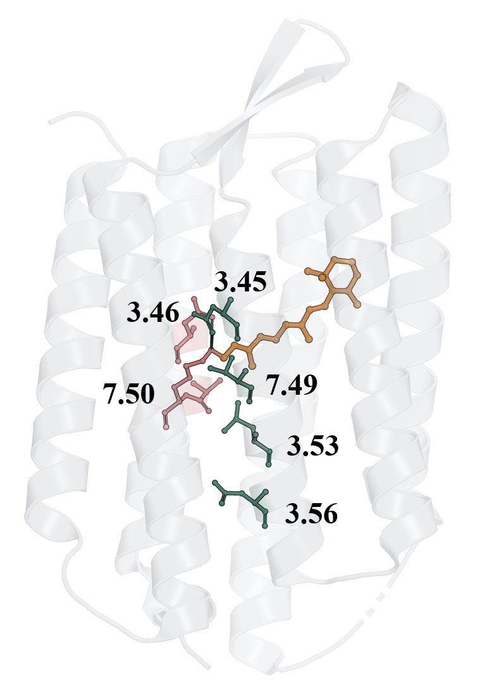

<h1 align="center">MOGRN</h1>

<p align="center">
  <b>Microbial Opsin Generic Residue Numbering.</b><br>
  One standardized coordinate system across hundreds of diverse type-I opsins — so any two can be compared, residue for residue.
</p>

<p align="center"></p>

<p align="center"><a href="https://flurinh.github.io/aboutme">◆ Portfolio</a></p>

<p align="center"><i>You may also be interested in</i></p>

<table align="center"><tr>
<td align="left">←&nbsp; <b>Previous work</b><br><a href="https://github.com/flurinh/protos">ProtOS — the framework underneath</a></td>
<td width="56"></td>
<td align="right"><b>Continuation of this project</b> &nbsp;→<br><a href="https://github.com/flurinh/lambda">Lambda — predicting opsin colour</a></td>
</tr></table>

---

## What it is

Microbial opsins are light-driven pumps, channels, and sensors built on a shared seven-helix
fold. MOGRN assigns a **Generic Residue Numbering** (GRN) that maps each residue to a
structurally equivalent position across the whole family, then uses it for **conservation
analysis, motif detection, co-evolution, and pump-vs-channel function discrimination** at
scale. It is the basis of my lead-author residue-numbering paper.

Anchor positions (the `.50` set): **3.50** — the functional switch (T in pumps → C in
channels); **6.50** — the conserved retinal-pocket tryptophan; **7.50** — the Schiff-base lysine.

<p align="center">
  🔬 <b>Explore the results:</b> <a href="https://rhodo.psi.ch/"><b>rhodo.psi.ch</b></a>
  &nbsp;·&nbsp;
  📄 <b>Paper:</b> <i>A Generic Residue-Numbering System for Microbial Rhodopsins</i><br>
  F. Hidber <i>et al.</i> — under review at <i>npj Structural &amp; Molecular Biology</i> (2026)
</p>

## Built on ProtOS

MOGRN runs on the **[ProtOS](https://github.com/flurinh/protos)** framework (GRN processor,
structure/sequence handling):

```bash
git clone https://github.com/flurinh/protos.git && pip install -e protos
git clone https://github.com/flurinh/MOGRN.git && cd MOGRN
pip install -r requirements.txt
```

## Pipeline

```bash
python prepare_data.py    # 1. validate structures, set up caching
python prepare_yaml.py    # 2. sequence configuration
# 3–6: GRN assignment → conservation → motif detection → function analysis
```

See [`GUIDE.md`](GUIDE.md) for the full walkthrough and the required data folders.

## How it fits

GRN is the coordinate system that lets **[Lambda](https://github.com/flurinh/lambda)** line up
binding pockets across opsins and predict their colour.
